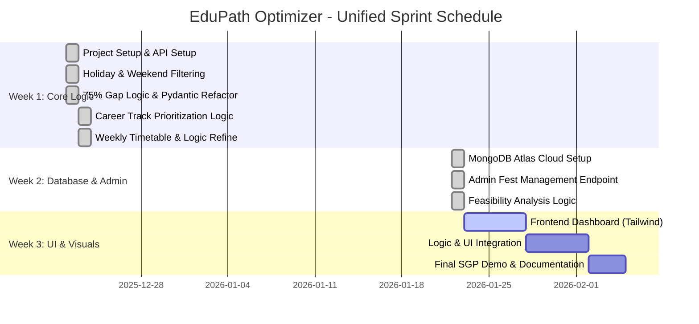

# 🎓 EduPath Optimizer
> **An AI-Driven Strategic Attendance Suggestion System for University Students.**


**EduPath Optimizer** is an intelligent academic assistant that transitions from a simple attendance calculator into a diagnostic mentor. It helps students maintain their 75% attendance criteria while prioritizing lectures that align with their **Career Tracks** (Data Science, IOT, etc.) and identifying knowledge gaps across semesters.

---

## 🌟 Key Features
### 📅 Phase 1: Attendance Core (Active Milestone)
- [x] **Automated Holiday Fetching:** Integrated with `holidays` API to auto-skip public holidays.
- [x] **Weekend Logic:** Intelligent filtering of non-instructional days (Sat/Sun).
- [x] **75% Gap Analysis:** Real-time calculation of future classes required to stay safe.
- [x] **Database Integration:** Centralized storage of Timetables and Career Tracks via **MongoDB Atlas**.
- [x] **Admin Fest Management:** Teacher-facing endpoint to add university events as holidays.
- [x] **Career Prioritization:** Algorithms to suggest dates based on professional interests.
- [x] **Feasibility Warning:** AI alerts when a target percentage becomes mathematically impossible.

### 🧠 Phase 2: End-Sem Strategy (Next)
- [ ] **Attendance + CIE + Mid-Term Analysis:** Predicts exam risk using performance data.
- [ ] **Stress Ranking:** Identifies "Double Danger" subjects (Low marks + Low attendance).

### 🔗 Phase 3: Academic Bridge
- [ ] **Knowledge Gap Detection:** Links last semester's Uni Exam results to current prerequisites.
- [ ] **Foundation Planning:** Connects past semester data to help in the new semester success.

---

## 📊 Development Roadmap (Gantt Chart)




## 🛠️ Tech Stack
- **Backend:** [FastAPI](https://fastapi.tiangolo.com/) (Python)
- **Database:** [MongoDB Atlas](https://www.mongodb.com/atlas)
- **Validation:** [Pydantic v2](https://docs.pydantic.dev/)
- **API:** [Python-Holidays](https://pypi.org/project/holidays/)
- **Frontend:** HTML5, Tailwind CSS, JavaScript

---

## 🧠 Future Roadmap
### Phase 2: End-Sem Strategy
- [ ] **CIE + Attendance Analysis:** Combines mid-term marks with attendance to predict exam risk.
- [ ] **Stress Ranking:** Identifies "Double Danger" subjects (Low marks + Low attendance).

### Phase 3: Academic Bridge
- [ ] **Knowledge Gap Detection:** Links last semester's Uni Exam results to current prerequisites.
- [ ] **Foundation Planning:** Recommends bridge-courses for subjects where the student lacked foundation.

---

## ⚙️ Setup & Installation

1. **Clone the repository:**
   ```bash
   git clone https://github.com/chaitany851P/EduPath-Optimizer.git
   cd EduPath-Optimizer
   ```
## ⚙️ Setup
1. **Venv:** `python -m venv venv`
2. **Activate:** `.\venv\Scripts\activate` (Win) or `source venv/bin/activate` (Mac)
3. **Install:** `pip install fastapi uvicorn holidays`
4. **Run:** `uvicorn main:app --reload`

---
## 👨‍💻 Author
**Chaitany Thakar**
*SGP Project - University Attendance Optimizer*
